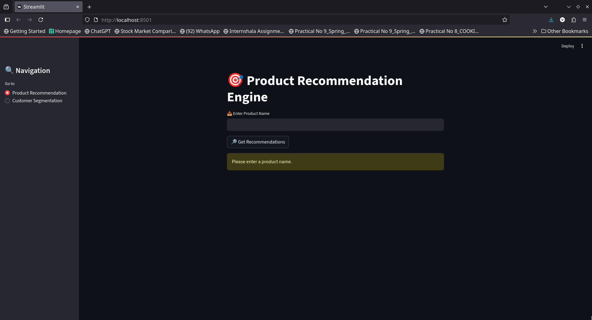
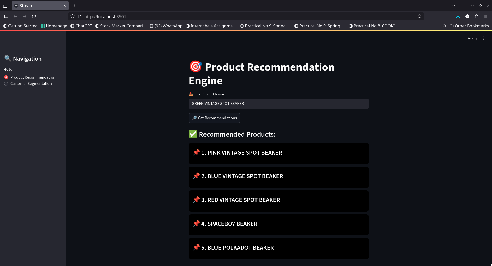
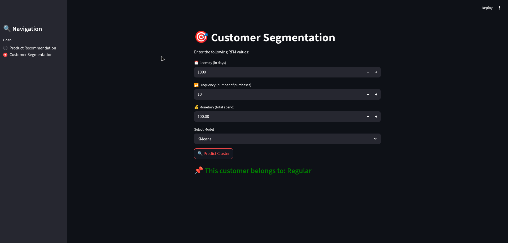

# 🧠 Customer Segmentation and Product Recommendation using Machine Learning

This project is a **Streamlit web application** built to provide:
- 📌 Intelligent **Product Recommendations** using product name similarity.
- 📊 **Customer Segmentation** using **RFM (Recency, Frequency, Monetary)** analysis and clustering models like KMeans, Agglomerative Clustering, and DBSCAN.

The aim is to assist businesses in understanding customer purchasing behavior and to recommend relevant products based on input.

---

## 📸 App Interface - Screenshots

### Product Recommendation


### Product Recommendation


### Customer Segmentation


---

## 📁 Repository Structure

```
Project
 ┣ app.py                          # Final Streamlit application
 ┣ Customer_Segmentation.ipynb     # Notebook with clustering and modelling
 ┣ images                          # Screenshots of app interface
 ┃ ┣ Shoppers Dashboard.png
 ┃ ┗ Product_recommendation.png
 | ┗ Customer_segmentation.png
 ┣ models                          # Trained ML models
 ┃ ┣ kmeans_model.joblib
 ┃ ┣ agg_model.joblib
 ┃ ┗ dbscan_model.joblib
 ┣ product_data.csv               # Product dataset
 ┣ rfm_scaled.csv                 # RFM dataset
 ┣ requirements.txt
 ┗ README.md
```

---

## 📈 Features

### ✅ 1. Product Recommendation
- Input a product name via the textbox
- Returns 5 similar product names using **TF-IDF vectorization** and **cosine similarity**
- Interactive UI with recommendations shown in a **card-style display**

### ✅ 2. Customer Segmentation
- Inputs: **Recency**, **Frequency**, **Monetary**
- Model options:
  - **KMeans**
  - **Agglomerative Clustering**
  - **DBSCAN**
- Returns:
  - Segment Label: High-Value, Regular, Occasional, At-Risk
  - Warning if Agglomerative or DBSCAN fail due to input shape or prediction limitations

---

## 💾 Dataset

> 🔗 **[https://drive.google.com/file/d/1rzRwxm_CJxcRzfoo9Ix37A2JTlMummY-/view](#)**  

- `rfm_scaled.csv` — Contains Recency_scaled, Frequency_scaled, Monetary_scaled
- `product_data.csv` — Contains CustomerID and ProductName

---

## ⚙️ Installation & Usage

### 🔧 Install required libraries

```bash
pip install -r requirements.txt
```

### 🚀 Run the Streamlit App

```bash
streamlit run app.py
```

---

## 🚀 Tech Stack & Tools

- **Languages**: Python
- **Libraries**:  
  `Pandas`, `NumPy`, `Scikit-learn`, `Streamlit`
- **Techniques**:
  - Data Cleaning  
  - Feature Engineering  
  - Exploratory Data Analysis (EDA)  
  - RFM Analysis  
  - KMeans Clustering  
  - Agglomerative Clustering  
  - DBSCAN  
  - Cosine Similarity  
  - Collaborative Filtering  
  - Real-Time Prediction  
- **Concepts**:
  - Customer Segmentation  
  - Product Recommendation System  
  - Standard Scaling  
  - Pivot Tables  
  - Data Transformation  
  - Machine Learning Model Integration  
- **Visualization**: Streamlit UI Cards & Graphs

---

## 🔐 Notes on Clustering Models

- **Agglomerative Clustering** and **DBSCAN** do not support `.predict()` directly.
- In this app:
  - Agglomerative is applied using `.fit_predict()` (may throw a warning on a single input)
  - DBSCAN is included for comparison, but will raise an informative error on prediction attempt

---

## 📮 Author

Made with ❤️ by **[Vishwesh Neelesh](https://github.com/GeekyVishweshNeelesh)**  
🔗 GitHub: [@GeekyVishweshNeelesh](https://github.com/GeekyVishweshNeelesh)

---
